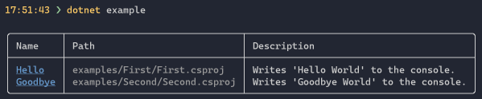
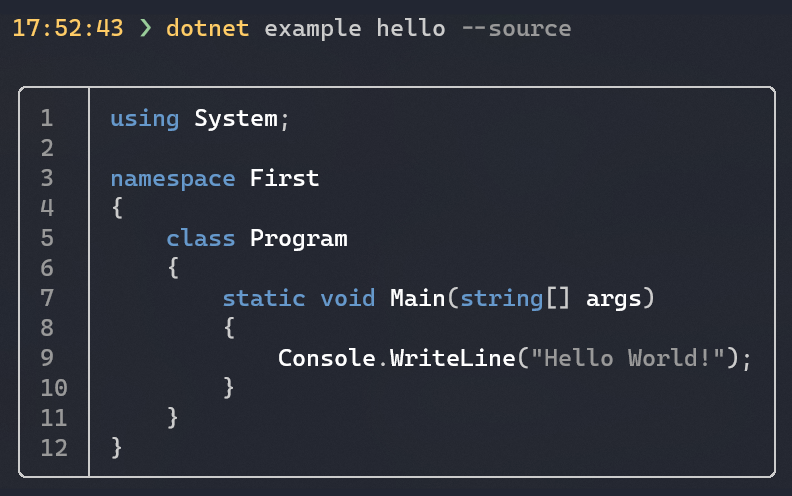

# dotnet example

A dotnet tool to list and run examples similar to Rust's `cargo run --example`.

## Installing

```
> dotnet tool install -g dotnet-example
```

## Listing examples

```
> dotnet example
```



## Running examples

```
> dotnet example hello
Hello World!
```

## Showing example source code

```
> dotnet example hello --source
```



## Conventions

The convention is simple, if there is an `examples`, `samples` or `eg` folder
in the directory the tool is executed in, it will fetch all csproj files 
and find the best match to the query.

## Example settings

To change the name, description, and the order of an example, edit it's `csproj` file, and add the following section:

```csharp
<PropertyGroup>
  <ExampleTitle>Foo</ExampleTitle>
  <ExampleDescription>This is the description of the example.</ExampleDescription>
  <ExampleOrder>5</ExampleOrder>
</PropertyGroup>
```

If no name is set in the `csproj` file, the project name will be used.